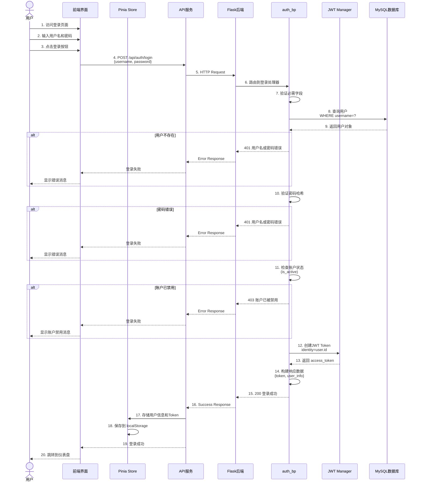

# NeuroVision 脑肿瘤检测系统 - 系统设计图

## 1. 用例图 (Use Case Diagram)

## 2. 系统主要流程图 (Main System Flow Chart)

## 3. 系统功能结构图 (System Function Structure Diagram)

## 4. 系统数据流图 (Data Flow Diagram)

## 5. 用户管理时序图 (User Management Sequence Diagram)

### 5.1 用户注册流程

### 5.2 用户登录流程

### 5.3 管理员管理用户流程

### 5.4 用户修改个人资料流程

## 6. 核心检测流程时序图 (Detection Sequence Diagram)

## 系统技术栈总结

### 前端技术栈
- **框架**: Vue 3 + TypeScript
- **构建工具**: Vite
- **路由**: Vue Router
- **状态管理**: Pinia
- **3D渲染**: Three.js + OrbitControls
- **UI组件**: 自定义组件库
- **HTTP客户端**: Axios

### 后端技术栈
- **框架**: Flask
- **ORM**: Flask-SQLAlchemy
- **认证**: Flask-JWT-Extended
- **数据库**: MySQL (pymysql驱动)
- **AI框架**: PyTorch + Ultralytics (YOLO)
- **图像处理**: Pillow, OpenCV, nibabel, pydicom
- **3D处理**: trimesh, SimpleITK

### AI模型
- **YOLO11**: 目标检测与实例分割
- **UNet**: 语义分割
- **ResNeXt50**: 分类与特征提取

### 数据存储
- **关系数据库**: MySQL
- **文件存储**: 本地文件系统
  - 医学影像: `backend/uploads/medical_images/`
  - NII文件: `backend/uploads/nii_files/`
  - 分割结果: `backend/uploads/segmentation_results/`
  - 3D模型: `backend/uploads/3d_models/`

---

**文档版本**: 1.0  
**生成日期**: 2026年1月6日  
**系统版本**: NeuroVision v1.0
