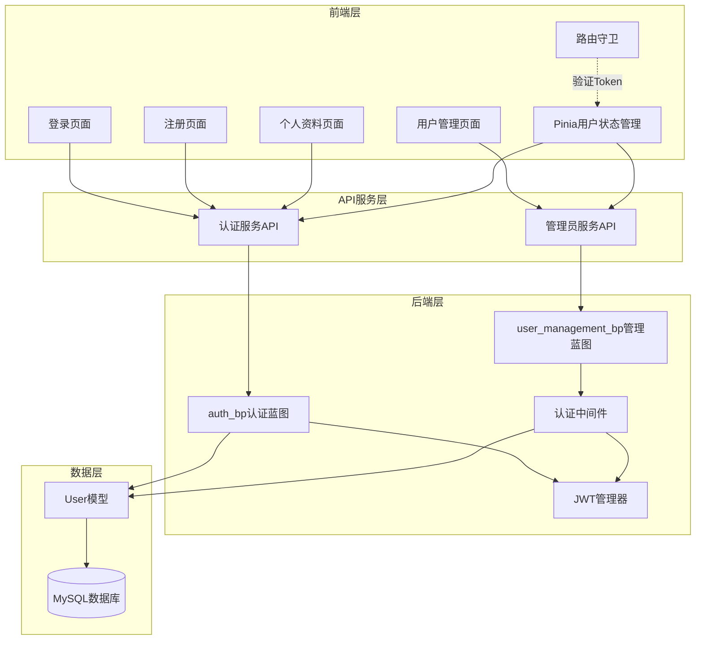
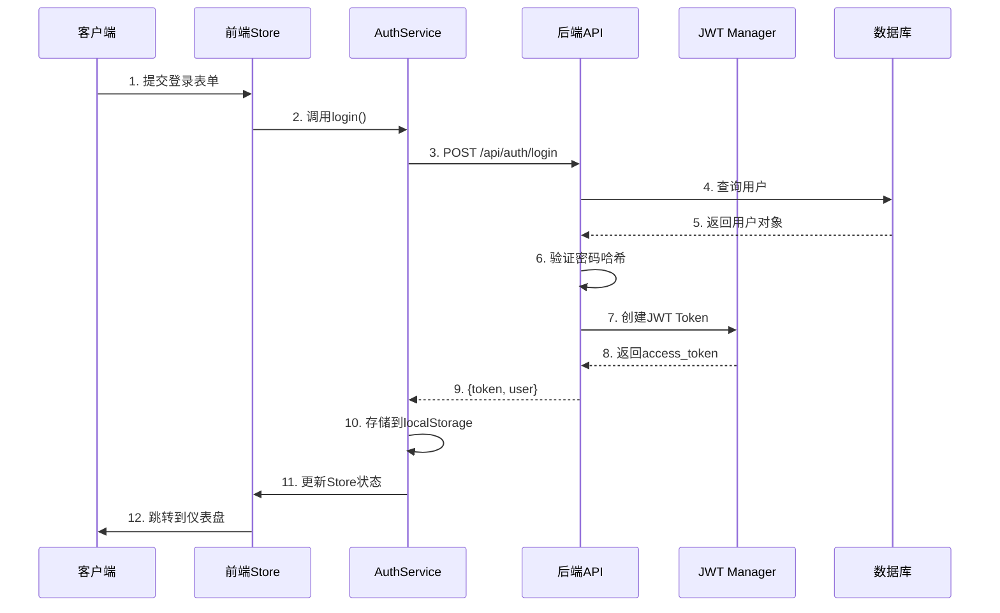

# NeuroVision 系统实现文档

## 第一阶段：用户管理与权限控制模块实现

### 5.1 用户管理与权限控制模块实现

#### 5.1.1 模块概述

用户管理与权限控制模块是系统的基础安全模块，负责用户身份认证、权限验证、用户信息管理等核心功能。该模块采用基于JWT（JSON Web Token）的无状态认证机制，支持多角色权限管理，确保系统的安全性和可扩展性。

**核心功能：**
- 用户注册与登录
- JWT令牌生成与验证
- 基于角色的权限控制（RBAC）
- 用户信息管理（CRUD）
- 密码安全管理
- 个人资料管理
- 管理员用户管理

#### 5.1.2 技术架构设计

##### 5.1.2.1 系统架构图



##### 5.1.2.2 认证流程架构



#### 5.1.3 数据库设计

##### 5.1.3.1 用户表（users）

| 字段名        | 数据类型     | 约束                      | 说明         |
| ------------- | ------------ | ------------------------- | ------------ |
| id            | INTEGER      | PRIMARY KEY               | 用户唯一标识 |
| username      | VARCHAR(80)  | UNIQUE, NOT NULL          | 用户名       |
| email         | VARCHAR(120) | UNIQUE, NOT NULL          | 邮箱地址     |
| password_hash | VARCHAR(255) | NOT NULL                  | 密码哈希值   |
| created_at    | DATETIME     | DEFAULT CURRENT_TIMESTAMP | 创建时间     |
| is_active     | BOOLEAN      | DEFAULT TRUE              | 账户是否激活 |
| is_admin      | BOOLEAN      | DEFAULT FALSE             | 是否为管理员 |

**索引设计：**
```sql
CREATE INDEX idx_username ON users(username);
CREATE INDEX idx_email ON users(email);
CREATE INDEX idx_is_active ON users(is_active);
CREATE INDEX idx_is_admin ON users(is_admin);
```

**数据库模型设计说明：**

用户模型（User Model）是系统的核心数据实体，使用SQLAlchemy ORM框架进行定义。模型设计遵循以下原则：

1. **字段映射**：每个数据库字段都映射为类属性，通过`db.Column`定义字段类型和约束
2. **密码安全**：提供`set_password()`方法对明文密码进行哈希处理，使用Werkzeug的`generate_password_hash`函数实现安全加密
3. **密码验证**：`check_password()`方法使用`check_password_hash`函数验证用户输入密码与存储的哈希值是否匹配
4. **数据序列化**：`to_dict()`方法将用户对象转换为字典格式，便于JSON序列化和API响应
5. **时间处理**：创建时间使用`datetime.utcnow`自动记录UTC时间戳，确保时区一致性

#### 5.1.4 核心功能实现

##### 5.1.4.1 用户注册功能

**后端实现流程：**

用户注册接口位于`backend/routes/auth.py`的`auth_bp`蓝图中，处理POST请求到`/register`路由。实现采用六步验证流程确保数据安全性和完整性：

1. **接收请求数据**：从HTTP请求体中解析JSON格式的用户数据，包括用户名、邮箱和密码三个必需字段

2. **必需字段验证**：检查三个核心字段是否都存在且非空，如果缺少任何字段则返回400错误和相应提示信息

3. **邮箱格式验证**：使用正则表达式`[^@]+@[^@]+\.[^@]+`验证邮箱格式的合法性，确保符合基本邮箱格式规范

4. **用户名唯一性检查**：通过SQLAlchemy查询数据库中是否已存在相同用户名，若存在则返回409冲突状态码，提示"用户名已存在"

5. **邮箱唯一性检查**：同样检查邮箱是否已被注册，防止同一邮箱注册多个账户，确保邮箱的唯一性约束

6. **创建并保存用户**：实例化User对象，调用`set_password()`方法对明文密码进行哈希加密处理，然后通过数据库会话添加到数据库并提交事务。成功后返回201状态码和新用户ID

整个过程使用try-except结构包裹，确保发生异常时能够回滚数据库事务并返回友好的错误信息。

**前端实现流程：**

注册页面（RegisterView.vue）使用Vue 3 Composition API构建，核心流程包括：

1. **表单状态管理**：使用ref响应式变量维护表单数据（用户名、邮箱、密码、确认密码）、加载状态和错误消息

2. **前端验证**：在提交前执行客户端验证，包括检查必填字段完整性、密码与确认密码一致性、密码长度限制（至少6个字符）

3. **异步提交**：通过Pinia状态管理的userStore调用register方法，该方法内部封装了API请求逻辑

4. **结果处理**：注册成功后显示成功提示并通过Vue Router跳转至登录页面；失败时捕获错误并在界面上展示错误消息

5. **用户体验优化**：使用loading状态禁用提交按钮防止重复提交，错误信息实时展示在表单下方便用户修正

前端与后端采用RESTful API通信，所有数据传输使用JSON格式，确保前后端数据结构的一致性。

##### 5.1.4.2 用户登录功能

**后端认证流程：**

登录接口同样位于`auth_bp`蓝图，通过POST请求处理`/login`路由。采用JWT（JSON Web Token）无状态认证机制，整个流程分为五个关键步骤：

1. **接收凭证**：解析HTTP请求体中的JSON数据，提取用户名和密码字段，并进行非空验证

2. **用户查询**：使用SQLAlchemy的`filter_by`方法根据用户名从数据库中查询对应的用户记录

3. **多重验证**：对查询结果进行三重验证检查：
   - 用户是否存在于数据库中
   - 密码哈希值是否匹配（通过`check_password`方法）
   - 账户激活状态（`is_active`字段）必须为True

4. **生成JWT令牌**：验证通过后，使用Flask-JWT-Extended的`create_access_token`函数生成访问令牌，将用户ID作为令牌的身份标识（identity），令牌过期时间由配置文件中的`JWT_ACCESS_TOKEN_EXPIRES`参数控制（默认3600秒，即1小时）

5. **返回响应**：构建包含令牌和用户基本信息的JSON响应，用户信息包括ID、用户名、邮箱和管理员标识，状态码为200表示成功

如果任何验证步骤失败，系统返回401未授权状态码和统一的错误提示"用户名或密码错误"，避免泄露用户存在性信息。

**前端状态管理：**

前端使用Pinia进行全局用户状态管理，在`stores/user.ts`中定义了用户存储模块，核心功能包括：

1. **状态定义**：维护两个核心响应式状态：
   - `user`：存储当前登录用户的完整信息对象
   - `isAuthenticated`：布尔值标识用户登录状态

2. **登录方法**：封装登录逻辑，调用authService的login方法发送API请求，接收响应后执行以下操作：
   - 更新user状态为服务器返回的用户信息
   - 将isAuthenticated设置为true
   - authService内部会自动将JWT令牌存储到localStorage

3. **登出方法**：清除本地存储的令牌和用户状态，将isAuthenticated重置为false

4. **令牌持久化**：JWT令牌存储在浏览器的localStorage中，键名为'access_token'，页面刷新后可自动恢复登录状态

5. **自动认证**：组件挂载时调用checkAuthStatus方法，检查localStorage中是否存在有效令牌，如有则尝试获取用户信息恢复登录状态

这种设计实现了客户端无状态会话管理，减轻服务器会话存储负担，同时保证了跨标签页的状态一致性。

##### 5.1.4.3 JWT认证中间件

**中间件设计原理：**

系统实现了两个核心装饰器用于接口权限控制，位于`backend/middleware.py`模块中。这种设计模式称为装饰器模式，通过函数包装实现横切关注点的统一处理。

**基础认证装饰器（require_auth）：**

该装饰器用于保护需要登录才能访问的接口，工作机制如下：

1. **令牌验证**：调用Flask-JWT-Extended的`verify_jwt_in_request()`函数，自动从HTTP请求头的Authorization字段中提取Bearer令牌并验证其有效性（签名、过期时间）

2. **用户提取**：验证通过后，使用`get_jwt_identity()`获取令牌中存储的用户ID（identity字段），该ID在登录时被编码到令牌中

3. **数据库查询**：根据用户ID从数据库查询完整的用户对象，确保用户仍然存在且账户处于激活状态

4. **参数注入**：将查询到的用户对象作为第一个参数自动注入到被装饰的视图函数中，命名为`current_user`，这样业务逻辑可以直接访问当前登录用户的所有信息

5. **异常处理**：任何验证失败（令牌无效、过期、用户不存在、账户未激活）都会捕获异常并返回401或403错误响应

**管理员权限装饰器（require_admin）：**

该装饰器在基础认证之上增加了管理员权限验证：

1. 首先执行与require_auth相同的令牌验证和用户查询步骤

2. 额外检查用户对象的`is_admin`字段是否为True

3. 只有管理员用户才能继续执行，非管理员访问会返回403 Forbidden状态码和"需要管理员权限"的提示

**使用场景示例：**

对于医学影像上传接口，需要用户登录但不需要管理员权限，使用`@require_auth`装饰器即可。装饰器会自动将当前登录的用户对象注入为第一个参数：

```
@medical_images_bp.route('/upload', methods=['POST'])
@require_auth
def upload_image(current_user):
    # current_user已包含完整用户信息，可直接使用
    print(f"当前用户: {current_user.username}")
    print(f"用户ID: {current_user.id}")
    # 业务逻辑处理...
```

对于用户管理接口（获取所有用户列表），需要管理员权限，需要同时使用`@jwt_required()`和`@admin_required`两个装饰器：

```
@user_management_bp.route('/users', methods=['GET'])
@jwt_required()  # Flask-JWT-Extended的装饰器，验证令牌
@admin_required  # 自定义装饰器，验证管理员权限
def get_users():
    # 只有管理员能访问此接口
    # 业务逻辑...
```

这种设计的优势在于代码复用性高、逻辑清晰、易于维护。所有需要权限控制的接口只需添加相应装饰器，无需在每个函数内部重复编写验证代码。

##### 5.1.4.4 管理员用户管理功能

**用户列表查询功能：**

管理员可以通过专门的管理接口获取系统所有用户的列表信息，该功能实现了以下特性：

1. **分页支持**：通过URL查询参数`page`和`per_page`实现分页功能，默认每页显示10条记录。使用SQLAlchemy的`paginate`方法自动处理分页逻辑，返回当前页数据、总记录数和总页数

2. **搜索过滤**：支持通过`search`参数进行模糊搜索，搜索范围包括用户名和邮箱字段。使用SQLAlchemy的`contains`方法实现部分匹配查询

3. **权限控制**：接口使用`@jwt_required()`和`@admin_required`双重装饰器保护，确保只有已登录的管理员用户才能访问

4. **数据序列化**：将每个用户对象转换为包含ID、用户名、邮箱、创建时间、激活状态、管理员标识和角色标签的字典，便于前端展示

5. **响应格式**：返回的JSON对象包含用户数组、总数、总页数和当前页码，支持前端实现完整的分页UI组件

**用户创建功能：**

管理员可以直接创建新用户账号，实现流程如下：

1. **数据接收**：从请求体中提取用户名、角色、邮箱和密码参数。其中用户名为必填项，其他字段有默认值（邮箱默认格式为`用户名@example.com`，密码默认为`ChangeMe123`）

2. **唯一性验证**：查询数据库确保用户名不重复，防止创建冲突账号

3. **角色映射**：根据role参数（admin或doctor）设置用户的`is_admin`字段，实现角色到权限的映射

4. **密码处理**：使用Werkzeug的密码哈希函数对初始密码进行加密处理

5. **事务管理**：使用数据库会话的add和commit方法完成用户创建，异常时自动回滚

**用户更新功能：**

管理员可以修改用户的部分信息，支持更新的字段包括：

1. **邮箱更新**：修改前检查新邮箱是否已被其他用户使用，确保邮箱唯一性约束

2. **激活状态**：可以启用或禁用用户账号，通过修改`is_active`字段实现账号的软删除或恢复

3. **管理员权限**：可以升级普通用户为管理员或降级管理员为普通用户，通过修改`is_admin`字段实现

4. **原子操作**：所有字段更新在同一个数据库事务中完成，确保数据一致性

**用户删除功能：**

管理员可以彻底删除用户账号，删除操作具有以下特点：

1. **物理删除**：从数据库中永久移除用户记录，而非仅标记为删除状态

2. **级联处理**：根据数据库外键约束配置，可能同时删除该用户关联的医学影像、检测记录等数据

3. **确认机制**：前端实现二次确认对话框，防止误删除操作

4. **审计需求**：重要系统可考虑改为软删除（仅更新is_active状态），保留用户数据以满足审计要求

这些管理功能为系统提供了完整的用户生命周期管理能力，管理员可以方便地进行用户账号的创建、查询、更新和删除操作。

#### 5.1.5 前端路由守卫

**路由守卫实现原理：**

前端使用Vue Router的导航守卫机制实现自动化的权限控制，确保未登录用户无法访问受保护的页面。路由守卫的核心是`beforeEach`全局前置守卫，它在每次路由跳转前自动执行验证逻辑。

**路由元信息（Meta）配置：**

每个路由在定义时可以添加meta字段存储元数据，系统主要使用两个meta属性：
- `requiresAuth`：布尔值，标识该路由是否需要登录才能访问
- `title`：字符串，该页面的标题，用于动态设置浏览器标签页标题

**守卫执行流程：**

1. **页面标题设置**：首先从路由的meta.title读取页面标题，使用`document.title`设置浏览器标签页标题，若未配置则使用默认值"NeuroVision"

2. **认证状态检查**：从Pinia的userStore获取当前登录状态（isAuthenticated属性），该状态通过检查localStorage中是否存在有效JWT令牌来判断

3. **未登录拦截**：如果目标路由标记了`requiresAuth: true`但用户未登录（isAuthenticated为false），则执行拦截：
   - 阻止导航到目标页面
   - 重定向到登录页（/login）
   - 在URL查询参数中保存原始目标路径（redirect参数），登录成功后可以跳转回原页面

4. **已登录重定向**：如果用户已登录但尝试访问登录页面，自动重定向到仪表盘页面（/dashboard），避免重复登录

5. **正常放行**：其他情况下调用next()允许导航继续，正常加载目标页面组件

**用户体验优化：**

这种设计实现了透明的权限控制，用户无需手动判断是否有权限访问某个页面。当用户尝试访问受保护页面时：
- 未登录会自动跳转登录页，登录后可以返回原页面
- 已登录直接访问，无需额外操作
- 刷新页面后登录状态自动恢复（通过localStorage持久化）

**安全性说明：**

前端路由守卫主要提供用户体验层面的控制，真正的权限验证必须在后端API层面实现。前端守卫只是第一道防线，防止用户意外访问无权限页面，后端中间件才是安全的最终保障。

#### 5.1.6 API接口文档

##### 5.1.6.1 用户注册

```
POST /api/auth/register
Content-Type: application/json

请求体:
{
  "username": "testuser",
  "email": "test@example.com",
  "password": "password123"
}

响应:
201 Created
{
  "message": "用户注册成功",
  "user_id": 1
}

错误响应:
400 Bad Request - 缺少必需字段
409 Conflict - 用户名或邮箱已存在
500 Internal Server Error - 服务器错误
```

##### 5.1.6.2 用户登录

```
POST /api/auth/login
Content-Type: application/json

请求体:
{
  "username": "testuser",
  "password": "password123"
}

响应:
200 OK
{
  "message": "登录成功",
  "access_token": "eyJhbGciOiJIUzI1NiIsInR5cCI6IkpXVCJ9...",
  "user": {
    "id": 1,
    "username": "testuser",
    "email": "test@example.com",
    "is_admin": false
  }
}

错误响应:
400 Bad Request - 缺少用户名或密码
401 Unauthorized - 用户名或密码错误
```

##### 5.1.6.3 获取用户列表（管理员）

```
GET /api/admin/users?page=1&per_page=10&search=test
Authorization: Bearer {access_token}

响应:
200 OK
{
  "users": [
    {
      "id": 1,
      "username": "admin",
      "email": "admin@example.com",
      "created_at": "2026-01-01T00:00:00",
      "is_active": true,
      "is_admin": true,
      "role": "admin"
    }
  ],
  "total": 10,
  "pages": 1,
  "current_page": 1
}

错误响应:
401 Unauthorized - 未认证
403 Forbidden - 权限不足（非管理员）
```

#### 5.1.7 安全机制

##### 5.1.7.1 密码安全

**密码存储策略：**

系统采用业界标准的密码哈希机制确保用户密码安全，绝不以明文形式存储密码。具体实现使用Werkzeug安全模块提供的密码处理函数：

1. **哈希算法选择**：`generate_password_hash`函数默认使用scrypt算法，这是一种专门设计用于密码存储的慢速哈希算法，具有以下特点：
   - **内存困难性**：计算过程需要大量内存，增加暴力破解成本
   - **计算密集型**：即使使用专用硬件（GPU/ASIC）也难以快速计算
   - **自适应性**：可调节计算复杂度参数适应硬件性能发展

2. **自动盐值生成**：每次调用密码哈希函数时，系统自动生成随机盐值（salt）并混入密码，盐值与哈希结果一起存储。盐值的作用是：
   - 即使两个用户使用相同密码，存储的哈希值也完全不同
   - 防止彩虹表攻击（预计算哈希字典攻击）
   - 每个密码都有独特的盐值，必须单独破解

3. **密码设置流程**：用户注册或修改密码时，调用User模型的`set_password(plain_password)`方法，该方法内部调用哈希函数处理明文密码，将生成的哈希值存储到password_hash字段

4. **密码验证流程**：用户登录时，使用`check_password(plain_password)`方法验证密码。该方法调用`check_password_hash`函数，将用户输入的明文密码与数据库存储的哈希值进行比对，返回True或False

5. **安全保证**：即使数据库泄露，攻击者也无法直接获取用户的明文密码，只能尝试暴力破解，而scrypt算法的高计算成本使得破解代价极大

**密码强度建议：**

虽然系统在后端实施了强密码存储机制，但建议前端也实现密码强度检查，要求用户设置至少6个字符、包含大小写字母和数字的密码，进一步提升账户安全性。

##### 5.1.7.2 JWT令牌安全

**JWT配置策略：**

系统使用Flask-JWT-Extended扩展实现JWT令牌管理，在应用配置中设置两个关键参数：

1. **密钥配置（JWT_SECRET_KEY）**：
   - 作用是签名和验证JWT令牌的密钥，确保令牌未被篡改
   - 开发环境可使用默认值"change-me"，但生产环境必须修改为强随机字符串
   - 建议使用至少32位的随机字符串，可通过`openssl rand -hex 32`生成
   - 密钥必须严格保密，泄露将导致攻击者可以伪造有效令牌

2. **过期时间配置（JWT_ACCESS_TOKEN_EXPIRES）**：
   - 设置令牌的有效期，单位为秒，默认值3600秒（1小时）
   - 较短的过期时间提高安全性，即使令牌泄露影响也有限
   - 过期后用户需要重新登录获取新令牌
   - 可根据业务需求调整，医疗系统建议使用较短过期时间（如30分钟到2小时）

**前端令牌管理机制：**

前端的authService服务封装了令牌的完整生命周期管理：

1. **令牌存储**：`setToken`方法将服务器返回的JWT令牌存储到浏览器的localStorage中，使用固定键名'access_token'。localStorage提供持久化存储，页面关闭后令牌仍然保留

2. **令牌获取**：`getToken`方法从localStorage读取令牌，用于后续API请求。每次调用需要认证的API时，都会获取令牌并添加到HTTP请求头的Authorization字段

3. **令牌清除**：`removeToken`方法在用户登出时调用，从localStorage删除令牌，清除登录状态

4. **登录状态判断**：`isLoggedIn`方法通过检查localStorage中是否存在令牌来判断用户登录状态，返回布尔值供组件和路由守卫使用

5. **自动附加令牌**：系统通常会配置Axios请求拦截器，在每个HTTP请求发出前自动从localStorage获取令牌并添加到请求头，格式为`Authorization: Bearer <token>`

**令牌使用流程：**

用户登录成功后，后端返回JWT令牌，前端将其存储到localStorage。之后每次请求受保护的API时，前端自动在请求头中携带令牌。后端收到请求后，验证令牌的签名、过期时间和payload内容，验证通过则提取用户ID并处理请求，验证失败则返回401错误。

**安全考虑：**

localStorage存储方式存在XSS攻击风险（恶意脚本可读取令牌），但由于医疗系统通常部署在内网环境，且现代框架（Vue/React）默认转义用户输入防止XSS，风险相对可控。如需更高安全性，可考虑使用httpOnly Cookie存储令牌。

##### 5.1.7.3 防护措施

1. **SQL注入防护**：使用SQLAlchemy ORM自动转义
2. **XSS防护**：前端对用户输入进行HTML转义
3. **CSRF防护**：使用JWT无状态认证避免CSRF
4. **重复提交防护**：前端使用loading状态防止重复提交

#### 5.1.8 测试策略

**单元测试设计原则：**

用户管理模块的测试采用Python标准库unittest框架编写，遵循测试驱动开发（TDD）的最佳实践。测试用例设计需要覆盖正常流程和异常情况，确保代码的健壮性。

**测试环境配置：**

每个测试用例的生命周期分为三个阶段：

1. **setUp阶段**：在每个测试方法执行前自动调用，负责初始化测试环境：
   - 创建Flask应用实例，配置为测试模式（TESTING=True）
   - 创建测试客户端（test_client），用于模拟HTTP请求
   - 使用应用上下文创建测试数据库表结构
   - 确保每个测试都在干净的环境中运行

2. **测试执行阶段**：运行具体的测试方法，每个方法测试一个功能点

3. **tearDown阶段**：测试方法执行后自动调用，负责清理测试环境：
   - 移除数据库会话
   - 删除所有测试数据库表
   - 释放资源，避免测试间相互影响

**核心测试场景：**

**注册功能测试：**
- **成功注册测试**：提交完整的用户名、邮箱和密码，验证返回201状态码和用户ID，确认基本注册流程正常
- **重复用户名测试**：先注册一个用户，然后使用相同用户名但不同邮箱尝试再次注册，验证返回409冲突状态码，确保用户名唯一性约束生效
- **缺少字段测试**：提交不完整的注册数据，验证返回400错误，确保必填字段验证有效
- **邮箱格式测试**：提交格式错误的邮箱，验证返回400错误和格式提示

**登录功能测试：**
- **成功登录测试**：先执行注册创建用户，然后使用正确的用户名和密码登录，验证返回200状态码和JWT令牌，确认令牌存在且格式正确
- **错误密码测试**：使用正确用户名但错误密码尝试登录，验证返回401未授权状态码，确保密码验证逻辑正常
- **不存在用户测试**：使用未注册的用户名尝试登录，验证返回401错误，且错误信息不泄露用户是否存在
- **禁用账户测试**：登录后将用户设置为未激活状态，再次尝试登录应该失败

**权限控制测试：**
- **无令牌访问测试**：不携带JWT令牌访问受保护接口，验证返回401错误
- **过期令牌测试**：使用已过期的令牌访问接口，验证返回401错误
- **非管理员访问测试**：普通用户令牌访问管理员接口，验证返回403禁止访问
- **管理员权限测试**：管理员令牌访问管理员接口，验证返回正常数据

**用户管理测试：**
- **获取用户列表测试**：管理员获取用户列表，验证分页参数和搜索功能
- **创建用户测试**：管理员创建新用户，验证数据正确保存
- **更新用户测试**：管理员修改用户信息，验证更新生效
- **删除用户测试**：管理员删除用户，验证数据库记录被移除

**测试断言方法：**

测试用例使用unittest提供的断言方法验证结果：
- `assertEqual(a, b)`：验证两个值相等，如状态码是否为期望值
- `assertIn(item, container)`：验证某个键是否存在于响应JSON中
- `assertTrue(expression)`：验证表达式结果为真
- `assertIsNotNone(value)`：验证值不为None

**持续集成建议：**

测试用例应该集成到CI/CD流程中，每次代码提交后自动运行全部测试。可以配置GitHub Actions或GitLab CI，在代码合并前强制要求所有测试通过，确保代码质量。

#### 5.1.9 部署配置

##### 5.1.9.1 环境变量配置

**配置文件管理：**

系统使用环境变量管理敏感配置信息，避免将密钥等敏感数据硬编码到源代码中。配置信息存储在项目根目录的`.env`文件中，该文件应该添加到`.gitignore`防止提交到版本控制系统。

**核心配置项说明：**

1. **JWT_SECRET_KEY**：JWT令牌签名密钥
   - 用途：签名和验证所有JWT令牌，确保令牌真实性
   - 要求：必须使用强随机字符串，至少32字符
   - 生成方法：可使用`openssl rand -hex 32`或`python -c "import secrets; print(secrets.token_hex(32))"`
   - 重要性：泄露此密钥将导致安全漏洞，攻击者可伪造任意用户令牌

2. **JWT_ACCESS_TOKEN_EXPIRES**：令牌过期时间
   - 单位：秒
   - 默认值：3600（1小时）
   - 调整建议：根据安全需求调整，医疗系统建议1800-7200秒之间

3. **数据库连接配置**：
   - DB_USER：数据库用户名
   - DB_PASSWORD：数据库密码
   - DB_HOST：数据库服务器地址（localhost或远程IP）
   - DB_PORT：数据库端口（MySQL默认3306）
   - DB_NAME：数据库名称

**配置加载流程：**

应用启动时，Flask的`main.py`使用python-dotenv库自动加载`.env`文件中的环境变量。通过`os.getenv()`函数读取配置值，并提供默认值作为后备。生产环境建议通过操作系统环境变量或容器配置注入，而非依赖`.env`文件。

##### 5.1.9.2 初始化管理员账户

**初始化脚本设计：**

系统提供`backend/init_db.py`脚本用于首次部署时初始化数据库结构和创建默认管理员账户。脚本执行逻辑如下：

1. **应用上下文创建**：使用Flask应用的`app_context()`上下文管理器，确保数据库操作在正确的应用环境中执行

2. **数据库表创建**：调用`db.create_all()`自动根据SQLAlchemy模型定义创建所有数据库表，包括users表和其他关联表。如果表已存在则跳过

3. **管理员检查**：查询数据库中是否已存在用户名为'admin'的用户，避免重复创建

4. **创建管理员**：如果不存在则创建新的User对象，设置以下属性：
   - username: 'admin'（默认管理员用户名）
   - email: 'admin@example.com'（可修改为实际邮箱）
   - is_admin: True（管理员权限标识）
   - is_active: True（账户激活状态）
   - password: 通过`set_password('admin123')`设置默认密码

5. **保存并提示**：将管理员账户添加到数据库会话并提交，打印成功消息提示管理员凭证

**使用方法：**

部署新系统时，在激活Python虚拟环境后执行：
```
cd backend
python init_db.py
```

**安全建议：**

1. 首次登录后立即修改默认管理员密码
2. 生产环境建议通过环境变量配置初始管理员凭证
3. 考虑实现强制首次登录修改密码的机制
4. 定期审计管理员账户，移除不再使用的管理员权限

#### 5.1.10 常见问题与解决方案

| 问题            | 原因                 | 解决方案                 |
| --------------- | -------------------- | ------------------------ |
| JWT令牌验证失败 | 令牌过期或无效       | 刷新令牌或重新登录       |
| 权限不足错误    | 非管理员访问管理接口 | 检查用户角色和权限       |
| 密码验证失败    | 密码不匹配           | 确认密码输入正确         |
| 邮箱格式错误    | 正则验证失败         | 使用标准邮箱格式         |
| 数据库连接失败  | 数据库配置错误       | 检查环境变量和数据库状态 |

#### 5.1.11 模块总结

用户管理与权限控制模块实现了完整的身份认证和授权机制，具备以下特点：

✅ **安全性**：密码哈希、JWT无状态认证、权限验证
✅ **可扩展性**：基于装饰器的权限控制，易于扩展
✅ **易用性**：前端状态管理、路由守卫自动处理认证
✅ **完整性**：注册、登录、用户管理全流程覆盖

---

**下一阶段预告**：5.2 医学影像与数据集管理模块实现

**文档版本**：v1.0  
**更新日期**：2026年1月6日  
**作者**：NeuroVision开发团队
